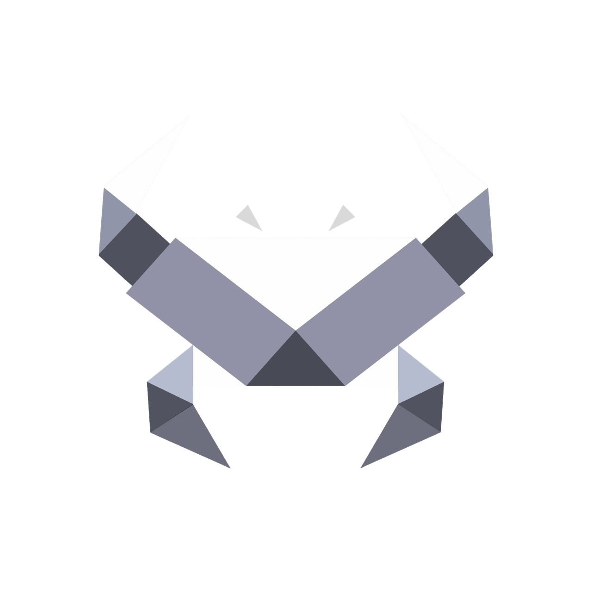

<div align="center">
  <a href="https://github.com/csanelo/Crab-Code-IDE">
    
  </a>

  <h1>CrabCode</h1>

  <p><strong>Desktop development environment with an integrated coding agent.</strong></p>
  <p>Editor, terminal, browser, project tools and model integrations in one focused workspace.</p>

  <p>
    <a href="https://t.me/Crab_Code"><strong>Telegram: @Crab_Code</strong></a>
    &nbsp;&nbsp;·&nbsp;&nbsp;
    <a href="https://t.me/csanelo"><strong>Developer: @csanelo</strong></a>
  </p>

  <p>
    <a href="https://github.com/csanelo/Crab-Code-IDE/actions/workflows/build-release.yml"></a>
    <a href="https://github.com/csanelo/Crab-Code-IDE/releases"></a>
    <a href="LICENSE"></a>
    <a href="https://t.me/Crab_Code"></a>
  </p>

  <p>
    <a href="#overview">Overview</a>
    &nbsp;·&nbsp;
    <a href="#capabilities">Capabilities</a>
    &nbsp;·&nbsp;
    <a href="#getting-started">Getting started</a>
    &nbsp;·&nbsp;
    <a href="#builds">Builds</a>
    &nbsp;·&nbsp;
    <a href="#architecture">Architecture</a>
  </p>
</div>

---

## Overview

CrabCode is a cross-platform desktop IDE built for direct work with code and AI-assisted development. It combines a Monaco editor, project explorer, terminal, browser and agent runtime inside a single Electron application.

The application is local-first. Projects remain on the machine. Provider credentials are stored locally and are never committed to the repository or embedded into release artifacts.

<table>
  <tr>
    <td><strong>Editor</strong><br />Monaco-based editing, tabs, file tree and language services.</td>
    <td><strong>Agent</strong><br />Project-aware tools for reading, editing, navigation and structured execution.</td>
  </tr>
  <tr>
    <td><strong>Terminal</strong><br />Integrated shell sessions with project context.</td>
    <td><strong>Browser</strong><br />Built-in page inspection for documentation and interface verification.</td>
  </tr>
  <tr>
    <td><strong>Connections</strong><br />OpenAI-compatible, Anthropic, Gemini and MCP integrations.</td>
    <td><strong>Remote work</strong><br />GitHub, SSH and remote project workflows from the same interface.</td>
  </tr>
</table>

## Capabilities

### Development workspace

- Monaco editor with multi-file navigation and project search
- Integrated terminal and file explorer
- Built-in browser for documentation and local application review
- Language server integration
- GitHub and SSH project workflows
- Native desktop packaging for Windows, Linux and macOS

### Agent runtime

- Reads and edits files with project boundaries
- Maintains project context and local memory
- Uses web tools only when the Web switch is enabled
- Uses desktop tools when High access is enabled and the task requires them
- Supports MCP servers and reusable Skills
- Works with OpenAI-compatible, Anthropic and Gemini providers

### Access model

| Mode | Behaviour |
| --- | --- |
| `Normal` | Restricts tools to the opened project. |
| `High` | Allows machine-level files, applications and desktop tools. |
| `Ask` | Requests approval before mutating actions. |
| `Plan` | Keeps the session read-only and returns an implementation plan. |

Desktop control is currently implemented for Windows through native system APIs. Other platforms retain editor, terminal, browser, SSH, MCP and project tools.

## Technology

<p>
  
  
  
  
  
</p>

## Getting started

### Requirements

- Node.js 26.5.0
- npm 10 or newer
- Git

### Installation

```bash
git clone https://github.com/csanelo/Crab-Code-IDE.git
cd Crab-Code-IDE
npm ci
```

### Development

```bash
npm run dev
```

### Validation

```bash
npm run typecheck
npm run build
```

## Builds

Build the native package for the current target platform:

```bash
npm run package:win
npm run package:linux
npm run package:mac
```

Compiled application files are written to `out/`. Installers and distributable packages are written to `dist/`.

| Platform | Output |
| --- | --- |
| Windows | NSIS installer, `.exe` |
| Linux | `.AppImage`, `.deb` |
| macOS | `.dmg`, `.zip` |

## CI/CD

The workflow at `.github/workflows/build-release.yml` installs exact dependencies with `npm ci`, runs TypeScript checks and packages the application on Windows, Linux and macOS.

Every push to `main` or `master` starts a build. Generated packages are attached to the workflow run. A version tag publishes the same artifacts as a GitHub Release.

```bash
git tag -a v0.3.2 -m "CrabCode 0.3.2"
git push origin v0.3.2
```

No additional GitHub secret is required for unsigned builds. The workflow uses the repository-provided `GITHUB_TOKEN` to publish releases.

## Architecture

```text
src/
├── main/       Electron main process, agent runtime and native services
├── preload/    Secure IPC bridge
└── renderer/   React interface, editor, chat, browser and settings

build/          Installer resources and application icons
resources/      Runtime resources
.github/        Build and release automation
```

The main process owns filesystem, terminal, browser, MCP, SSH and computer-control operations. The preload layer exposes a restricted IPC surface. The renderer contains no direct Node.js access.

## Configuration

Open **Settings** inside CrabCode and connect a provider. A provider configuration consists of a base URL, model identifier and API key. Supported connection paths include:

- OpenAI-compatible APIs
- Anthropic
- Gemini
- MCP servers
- GitHub
- SSH hosts

Credentials are encrypted with the operating system storage facilities when available.

## Security

- Keep API keys and tokens outside the repository.
- Do not commit `.env` files.
- Review High access actions before enabling autonomous editing.
- Use Ask mode when desktop or filesystem changes require confirmation.
- Publish signed installers when distributing production releases publicly.

## Project links

| Resource | Address |
| --- | --- |
| Telegram channel | [@Crab_Code](https://t.me/Crab_Code) |
| Developer | [@csanelo](https://t.me/csanelo) |
| Repository | [csanelo/Crab-Code-IDE](https://github.com/csanelo/Crab-Code-IDE) |
| Releases | [GitHub Releases](https://github.com/csanelo/Crab-Code-IDE/releases) |
| CI builds | [GitHub Actions](https://github.com/csanelo/Crab-Code-IDE/actions) |

## License

CrabCode is distributed under the [MIT License](LICENSE).

---

<div align="center">
  <sub>CrabCode 0.3.2 · maintained by <a href="https://t.me/csanelo">@csanelo</a></sub>
</div>
